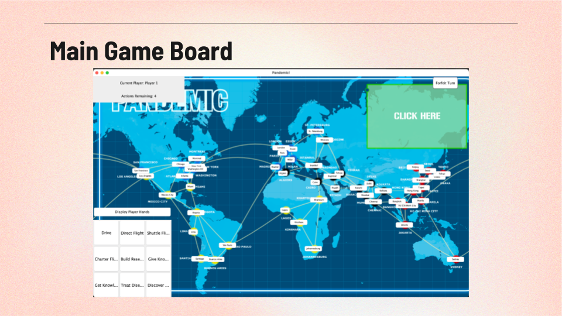

# CPSC 224 Final Project: git help

### Project Description:

### Team Information:

- Team Name:  `git help`
- Students on team: @tonixsmm, @izzytilles, @IsaacSShade, @kalfaro2025
- Semester: Spring 2024

### Google Doc
[Links to Google Doc](https://docs.google.com/document/d/1hPTK1y4hZ3LA0InziyuUyLRVY9c5pFsB75XJ_6ZjpD4/edit?usp=sharing)

[Link to Final Project Report](https://docs.google.com/document/d/1h99WVAo4LNFZ4NNbbGIGZU6Pnar4mBuX/edit?usp=sharing&ouid=102583322131353539102&rtpof=true&sd=true)

